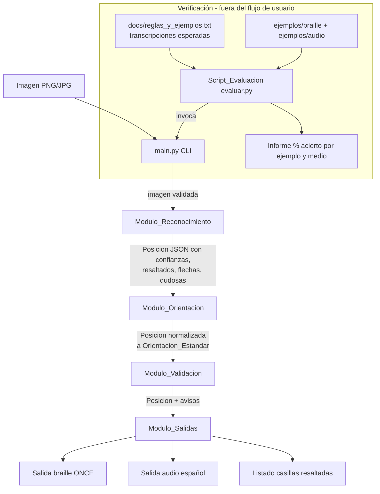

# Design Document

## Overview

"Tablero Accesible ONCE" es una herramienta de línea de comandos en Python que transforma la imagen de un diagrama de ajedrez en descripciones accesibles para personas ciegas. Todo el procesamiento ocurre en local, con OpenCV y comparación con plantillas, sin llamadas a servicios externos ni a internet (Requisito 1.8, 2.5).

El diseño se organiza como un **pipeline de cuatro módulos** que van transformando y enriqueciendo un único **formato intermedio de posición** (un objeto en memoria, serializable a JSON), que actúa como contrato entre etapas:

1. **Modulo_Reconocimiento**: de imagen a posición reconocida (piezas, resaltados, flechas, dudosas, confianza).
2. **Modulo_Orientacion**: normaliza la posición a orientación estándar (blancas abajo, columna a a la izquierda).
3. **Modulo_Validacion**: comprueba la legalidad de la posición y marca avisos, sin borrar ni inventar piezas.
4. **Modulo_Salidas**: genera la salida braille según la notación ONCE, la salida de audio en español y la lista de casillas resaltadas.

Alrededor del pipeline hay dos programas de entrada:

- **main.py (CLI)**: valida argumentos y la imagen de entrada, orquesta el pipeline y escribe las salidas por consola en español (Requisito 1).
- **Script_Evaluacion (evaluar.py)**: mide la precisión de la herramienta contra las transcripciones esperadas del documento de referencia y calcula porcentajes de acierto (Requisito 9, 10).

Decisiones de diseño clave y su motivación:

- **Un contrato JSON explícito entre módulos.** Permite probar cada etapa por separado, serializar posiciones intermedias para depuración y comparar salidas casilla a casilla en la evaluación. La orientación se corrige sobre este contrato antes de generar cualquier salida (Requisito 3.6).
- **Nunca inventar contenido.** La confianza (0.0–1.0) viaja con cada casilla; por debajo de 0.80 la casilla se marca como dudosa y queda sin pieza (Requisito 2.7, 2.8, 4.6). Las flechas detectadas automáticamente, de fiabilidad baja, se pueden complementar o sustituir con un parámetro manual `--flecha`.
- **Plantillas derivadas de los propios ejemplos.** Se generan plantillas para los dos estilos presentes en `ejemplos/` (color digital y libro en blanco y negro), lo que evita depender de datos externos y respeta el trabajo solo con `ejemplos/` durante el desarrollo (Requisito 10.1).

## Architecture

### Pipeline de módulos



### Responsabilidades y flujo del formato intermedio

| Etapa | Entrada | Salida | Enriquece el JSON con |
|-------|---------|--------|-----------------------|
| main.py (CLI) | Argumentos, ruta de imagen | Imagen decodificada (matriz OpenCV) | — (valida y decodifica) |
| Modulo_Reconocimiento | Imagen decodificada | Posición reconocida | `piezas`, `resaltadas`, `flechas` (auto), `dudosas`, `confianza` por casilla |
| Modulo_Orientacion | Posición reconocida | Posición en orientación estándar | `orientacion.detectada`, coordenadas normalizadas |
| Modulo_Validacion | Posición normalizada | Posición + avisos | `validacion.valida`, `validacion.avisos` |
| Modulo_Salidas | Posición validada | Textos de salida | — (consume el JSON, no lo altera) |

El flujo es estrictamente secuencial: cada módulo recibe el objeto de posición del anterior, lo enriquece o normaliza, y lo pasa al siguiente. El Modulo_Orientacion completa su corrección **antes** de que el Modulo_Salidas produzca nada (Requisito 3.6), y el Modulo_Validacion se ejecuta sobre la posición ya orientada, de modo que las comprobaciones de "peón en fila 1 u 8" operen sobre coordenadas correctas.

### Trazabilidad componente → requisitos

- **main.py (CLI)** → Requisito 1 (entrada, formatos, errores, español, local).
- **Modulo_Reconocimiento** → Requisito 2 (localización, clasificación, confianza, dudosas), 6.1/6.6 (resaltados), 7.1 (flechas).
- **Modulo_Orientacion** → Requisito 3 (detección y corrección de orientación).
- **Modulo_Validacion** → Requisito 4 (legalidad y avisos).
- **Modulo_Salidas** → Requisito 5 (braille), 6.2–6.5 (resaltados en salidas), 7.2–7.5 (flechas en salidas), 8 (audio).
- **Script_Evaluacion** → Requisito 9 (evaluación) y 10 (restricciones de datos).

## Components and Interfaces

Las interfaces se describen en pseudocódigo/firmas para explicar el contrato; no son código de implementación.

### main.py (CLI)

```
funcion principal(argumentos):
    si no hay ruta de imagen:
        imprimir uso "python main.py imagen.png"; salir            # Req 1.4
    ruta, flechas_manuales = parsear(argumentos)                   # admite --flecha ORIGEN-DESTINO (repetible)
    validar_extension_y_tamano(ruta)  -> error si no admitido      # Req 1.2, 1.5
    imagen = decodificar(ruta)        -> error si ilegible/dañada  # Req 1.3, 1.6
    pos = Modulo_Reconocimiento.reconocer(imagen)                  # Req 2, 6, 7
    pos = Modulo_Orientacion.corregir(pos)                         # Req 3
    pos = combinar_flechas_manuales(pos, flechas_manuales)         # Req 7
    pos = Modulo_Validacion.validar(pos)                           # Req 4
    imprimir Modulo_Salidas.braille(pos)                           # Req 5, 6, 7
    imprimir Modulo_Salidas.audio(pos)                             # Req 8
```

Todos los mensajes y salidas se emiten en español (Requisito 1.7). El parámetro `--flecha` puede aparecer varias veces (`--flecha f3-e5 --flecha d1-h5`).

### Modulo_Reconocimiento

```
reconocer(imagen) -> Posicion
    localizar_tablero(imagen)      # contorno cuadrangular 8x8; si falla -> error "no se detecta tablero" (Req 2.2)
    rejilla = dividir_en_64(area)  # 8 filas x 8 columnas (Req 2.3)
    estilo = detectar_estilo(imagen)              # color digital | libro b/n
    para cada casilla en rejilla:
        casilla_norm = normalizar_fondo(casilla, estilo)   # resta el color base clara/oscura de esa casilla
        vacia, conf_vacia = clasificar_vacia_o_no_vacia(casilla_norm)   # heurística de contenido (Req 2.4)
        si vacia claramente (contenido << umbral de "vacío"):
            registrar casilla vacía; confianza alta; NO dudosa   # una casilla vacía nítida no es dudosa
        sino:
            tipo, color, score = clasificar(casilla_norm, plantillas[estilo])   # template matching solo si NO vacía (Req 2.4, 2.5)
            confianza = score                      # 0.0-1.0 (Req 2.7)
            si confianza < 0.80: marcar dudosa; sin pieza  (Req 2.8)
        # las casillas ambiguas cerca del umbral vacío/no vacío también pueden marcarse dudosas (Req 2.8)
    resaltadas = detectar_resaltadas(area)         # Req 6.1, 6.6
    flechas = detectar_flechas(imagen)             # Req 7.1 (baja fiabilidad)
    devolver Posicion
```

### Modulo_Orientacion

```
corregir(pos) -> Posicion
    orient = detectar_orientacion(pos, imagen)     # estandar | girada | asumida (Req 3.1, 3.5)
    si orient == girada: rotar_coordenadas_180(pos)  # conserva contenido (Req 3.2)
    fijar pos.orientacion.detectada = orient
    devolver pos con columna a a la izquierda y fila 1 lado blancas (Req 3.4)
```

### Modulo_Validacion

```
validar(pos) -> Posicion
    avisos = []
    comprobar 1 rey blanco y 1 rey negro                    (Req 4.1)
    comprobar 0..8 peones por bando                         (Req 4.2)
    comprobar ningun peon en fila 1 u 8                     (Req 4.3)
    comprobar 0 o 1 pieza por casilla                       (Req 4.4)
    por cada comprobacion fallida: añadir aviso con casillas afectadas (Req 4.5)
       y marcar esas piezas como dudosas SIN eliminarlas    (Req 4.7)
    si hay casillas dudosas: aviso enumerando ubicaciones   (Req 4.6)
    si todo correcto y sin dudosas: "La posición es válida" (Req 4.8)
```

### Modulo_Salidas

```
braille(pos) -> texto          # Req 5, 6.2/6.3, 7.2-7.4
audio(pos)   -> texto          # Req 8, 6.4
```

Orden de piezas en ambas salidas: **Rey, Dama, Torre, Caballo, Alfil, Peones**; dentro de cada tipo, de columna a hacia h (Requisito 5.7, 5.8). En braille, cada bando en una línea (`Blancas:` y luego `Negras:`), tokens `Letra+columna+fila_braille` sin separador interno y separados entre sí por un espacio (Requisito 5.3, 5.5, 5.6, 5.9). En audio, solo caracteres del alfabeto español, dígitos, espacio y `, . :`, agrupando piezas del mismo tipo con comas y "y" final (Requisito 8.1, 8.4–8.7).

### Script_Evaluacion (evaluar.py)

```
evaluar():
    esperados = parsear_transcripciones(docs/reglas_y_ejemplos.txt)   # Req 9.1
    para cada ejemplo mapeado a un archivo de ejemplos/:
        val_esperada = Modulo_Validacion.validar(esperado)            # valida la transcripción del documento (p. ej. A6 doble en Diagrama 5)
        generado = invocar_herramienta(imagen_del_ejemplo)
        val_generada = Modulo_Validacion.validar(generado)           # valida la salida de la herramienta
        pct = comparar_casilla_a_casilla(generado, esperado)          # revela omisiones legales (p. ej. peón e4 del Diagrama 1) (Req 9.1, 9.2)
        reportar(ejemplo, val_esperada, val_generada, pct)            # (a) validación esperada, (b) validación herramienta, (c) % coincidencia
    imprimir pct por ejemplo y pct medio (2 decimales)                # Req 9.4
    imprimir acierto medio grupo plantillas y grupo evaluacion por separado  # métrica sin sobreajuste = grupo evaluación
    NUNCA usar el grupo de plantillas para medir precisión ni el de evaluación para crear plantillas
    NUNCA recorrer pruebas-nuevas/                                    # Req 10.2, 10.3
```

## Data Models

### Formato intermedio de la posición (contrato JSON entre módulos)

Este esquema es el contrato que fluye por el pipeline. Cada módulo lee y/o enriquece campos.

```json
{
  "orientacion": {
    "detectada": "estandar",          // "estandar" | "girada" | "asumida"
    "metodo": "etiquetas"             // "etiquetas" | "heuristica" | "indeterminada"
  },
  "piezas": [
    { "tipo": "Rey",  "color": "blanco", "columna": "e", "fila": 1, "confianza": 0.98 },
    { "tipo": "Dama", "color": "blanco", "columna": "d", "fila": 1, "confianza": 0.95 },
    { "tipo": "Peon", "color": "negro",  "columna": "d", "fila": 5, "confianza": 0.91 }
  ],
  "resaltadas": [
    { "casilla": "g3", "color": "amarillo" },
    { "casilla": "h4", "color": "amarillo" }
  ],
  "flechas": [
    { "origen": "d4", "destino": "d1", "sentido": "directo", "fuente": "manual" }
    // "sentido": "directo" (⠒⠕) | "inverso" (⠪⠒);  "fuente": "auto" | "manual"
  ],
  "dudosas": [
    { "casilla": "c6", "motivo": "confianza_baja" }
    // "motivo": "confianza_baja" | "color_resaltado_desconocido" | "validacion"
  ],
  "validacion": {
    "valida": false,
    "avisos": [
      "Peón en fila 8: casillas afectadas d8.",
      "Casillas dudosas: c6."
    ]
  }
}
```

Notas de contrato:

- `columna` es una letra `a`–`h`; `fila` es un entero `1`–`8`. Esta representación por coordenadas es la que compara el Script_Evaluacion casilla a casilla.
- `confianza` en `[0.0, 1.0]`. El umbral de duda es 0.80 (Requisito 2.8).
- Una casilla presente en `dudosas` con motivo `confianza_baja` **no** aparece en `piezas` (queda sin contenido, Requisito 2.8, 4.7). En cambio, las piezas marcadas dudosas por fallo de validación (motivo `validacion`) **sí** permanecen en `piezas` (Requisito 4.7).
- Una casilla **vacía detectada con claridad** (por la etapa previa vacía/no vacía del Modulo_Reconocimiento) no aparece en `piezas` ni en `dudosas`: es una casilla vacía con confianza alta. El motivo `confianza_baja` en `dudosas` proviene de la clasificación de **pieza** en casillas no vacías o de casillas ambiguas cerca del umbral vacío/no vacío, no de las casillas vacías nítidas.
- `resaltadas.color` ∈ {`amarillo`, `rojo`, `verde`, `azul`}; un color no clasificable no crea entrada en `resaltadas`, sino en `dudosas` con motivo `color_resaltado_desconocido` (Requisito 6.6).

### Tablas de notación braille (constantes de datos)

- Filas → braille (posición baja): `1⠂ 2⠆ 3⠒ 4⠲ 5⠢ 6⠖ 7⠶ 8⠦` (Requisito 5.1).
- Piezas → letra: `R` Rey, `D` Dama, `T` Torre, `A` Alfil, `C` Caballo, `P` Peón (Requisito 5.4).
- Flecha directa `⠒⠕`, flecha inversa `⠪⠒`, unión `¬` (Requisito 7.2, 7.3).

## Detección de orientación (Modulo_Orientacion)

Objetivo: dejar toda posición en orientación estándar (columna a a la izquierda, fila 1 en el lado de las blancas) clasificando el tablero en exactamente uno de dos estados: estándar o girado 180° (Requisito 3.1).

**Estrategia en dos niveles, de más fiable a menos fiable:**

1. **Lectura de etiquetas de coordenadas (preferente).** Los tableros de `ejemplos/braille/` muestran las letras `a`–`h` y los números `1`–`8` en los bordes. El módulo recorta las franjas de borde (inferior/lateral) y aplica reconocimiento sencillo por plantillas de dígitos/letras sobre esas franjas.
   - Si la letra más a la izquierda es `a` y el número inferior es `1` → **estándar**.
   - Si aparece invertido (`h` a la izquierda, `8` abajo) → **girada 180°**.
   - Método registrado: `"etiquetas"`.

2. **Heurística por posición de piezas (respaldo).** Cuando no hay etiquetas legibles (típico de los diagramas de libro de `ejemplos/audio/`), se infiere la orientación a partir de la distribución de reyes y peones ya reconocidos:
   - Los peones de cada bando tienden a ocupar filas hacia el centro-bajo de su lado; los reyes suelen situarse en la fila trasera de su bando.
   - Se calcula, para cada hipótesis (estándar vs girada), una puntuación de coherencia: cuánto encaja la masa de peones blancos en filas bajas y peones negros en filas altas, y los reyes en sus filas traseras.
   - Se elige la hipótesis con mayor coherencia. Método registrado: `"heuristica"`.

3. **Caso indeterminado.** Si ni las etiquetas ni la heurística superan un mínimo de confianza (por ejemplo, tablero casi vacío o simétrico), el módulo **asume orientación estándar**, fija `orientacion.detectada = "asumida"` y `metodo = "indeterminada"`, y emite un aviso en español indicando que la orientación no pudo determinarse y que se asume la estándar (Requisito 3.5).

**Corrección.** Si el estado es girado, se transforma cada coordenada mediante la rotación 180° `(columna, fila) → (i_columna_inversa, 9 - fila)` conservando el contenido de cada casilla (Requisito 3.2). Si ya es estándar, las coordenadas se entregan sin cambios (Requisito 3.3). Aplicar la rotación dos veces devuelve la posición original (ver Correctness Properties).

## Detección de casillas resaltadas (Modulo_Reconocimiento)

Objetivo: identificar casillas marcadas y clasificar su color en {amarillo, rojo, verde, azul}, sin inventar colores (Requisito 6.1, 6.6).

**Algoritmo:**

1. **Establecer los dos colores base del tablero.** Se muestrean varias casillas claras y varias oscuras conocidas (por su patrón de tablero de ajedrez, alternancia par/impar de fila+columna) y se calcula el color medio de las claras (`base_clara`) y de las oscuras (`base_oscura`). Así el algoritmo se adapta al tema concreto de la imagen (por ejemplo, verde/crema en los tableros digitales).
2. **Comparar cada casilla contra su base esperada.** Para cada casilla se calcula su color medio (idealmente sobre la zona sin pieza, o de forma robusta con la mediana) y se mide la diferencia respecto a la base que le correspondería por su paridad (clara u oscura).
3. **Decidir si está resaltada.** Si la diferencia supera un umbral, la casilla se considera resaltada.
4. **Clasificar el color del resaltado.** Se convierte el color medio a **HSV** (más estable frente a iluminación) y se asigna al color base más cercano por tono/saturación: amarillo, rojo, verde o azul.
5. **Color no clasificable → dudosa.** Si el color no encaja con suficiente cercanía en ninguno de los cuatro, la casilla se añade a `dudosas` con motivo `color_resaltado_desconocido` y se avisa, sin inventar el color (Requisito 6.6).

Si la imagen no contiene ninguna casilla resaltada, la sección correspondiente se omite en ambas salidas (Requisito 6.5).

## Flechas (Modulo_Reconocimiento y CLI)

Las flechas de los diagramas son difíciles de detectar de forma fiable, por lo que el diseño combina **detección automática best-effort** con **entrada manual explícita**.

**Detección automática (best-effort):**

1. Preprocesado (escala de grises, realce de bordes con Canny).
2. Detección de segmentos con `HoughLinesP` de OpenCV.
3. Fusión de segmentos colineales en trazos, y determinación de la **punta** (por presencia de dos segmentos cortos que forman la cabeza de flecha en un extremo) para fijar origen y destino.
4. Mapeo de los extremos a casillas mediante la rejilla 8x8, con `sentido` = `directo` o `inverso`.
5. Cada flecha detectada se guarda con `fuente: "auto"`. Por su baja fiabilidad esperada, estas flechas pueden quedar incompletas.

**Entrada manual (`--flecha ORIGEN-DESTINO`):**

- Parámetro CLI opcional y **repetible**: `--flecha f3-e5 --flecha d1-h5`.
- Cada valor se parsea a `{origen, destino}` validando que ambas sean casillas `a`–`h` × `1`–`8`. El `sentido` por defecto es `directo`; puede indicarse inverso con una sintaxis reservada (por ejemplo `--flecha e5-f3:inverso`) si se desea.
- Se guardan con `fuente: "manual"`.

**Combinación / sobrescritura:** las flechas manuales tienen prioridad. Si una flecha manual coincide en origen y destino con una detectada, sustituye a la automática (se conserva una sola entrada, `fuente: "manual"`). Las flechas manuales que no coinciden con ninguna automática se añaden. Así el usuario puede corregir o completar lo que la detección no acierta.

**Representación en salidas:**

- Braille: una línea por flecha, formato `origen¬⠒⠕¬destino` para sentido directo y `origen¬⠪⠒¬destino` para inverso (Requisito 7.2, 7.3, 7.4).
- Si el origen o destino de una flecha (auto o manual) no corresponde a una casilla válida, se avisa en español de la flecha no reconocida sin inventar casillas (Requisito 7.5).
- Audio: las flechas no usan símbolos braille ni `¬`; se describen con frases o se omiten para no ensuciar el lector de pantalla (Requisito 8.7).

## Creación de plantillas de piezas (Modulo_Reconocimiento)

Objetivo: construir un banco de plantillas para clasificar cada casilla por template matching, cubriendo los **dos estilos** presentes en `ejemplos/` (Requisito 2.6), sin datos externos (Requisito 10.1).

**Fuentes de plantillas:**

- `ejemplos/braille/` → estilo **color digital** (piezas vectoriales sobre tablero verde/crema, con etiquetas y resaltados).
- `ejemplos/audio/` → estilo **libro en blanco y negro** (piezas de imprenta sobre casillas claras u oscuras con tramado).

**Separación estricta de datos (anti-sobreajuste).** Las plantillas se generan **únicamente** a partir del **grupo de plantillas** definido en la sección "Estrategia de verificación" (`tablero1`, `tablero3`, `tablero5`, `diagrama02`, `diagrama23`). Los ejemplos del **grupo de evaluación** (`tablero2`, `tablero4`, `tablero6`, `diagrama01`, `diagrama05`) **nunca** se usan para crear plantillas, de modo que la medida de precisión sobre ellos no esté contaminada por sobreajuste. Ambos grupos cubren los dos estilos (color digital y libro b/n), por lo que el grupo de plantillas basta para representar ambos estilos (Requisito 2.6).

**Clasificación previa vacía / no vacía.** Antes de recortar o comparar plantillas, cada casilla pasa por una etapa de **detección de contenido**: tras normalizar el fondo del tablero (restar el color base de la casilla clara u oscura correspondiente), se estima si la casilla está vacía mediante una heurística de contenido, por ejemplo **baja varianza de intensidad** y/o **baja densidad de bordes** (número de píxeles de borde tras Canny sobre la casilla normalizada) por debajo de un umbral. Una casilla claramente por debajo del umbral se considera **vacía con confianza alta** y **no** es dudosa; solo las casillas **no vacías** se comparan contra las plantillas de piezas. Las casillas ambiguas cerca del umbral vacío/no vacío pueden marcarse como dudosas (Requisito 2.8).

**Proceso de generación (offline, una vez, guardado en disco):**

1. A partir de una posición conocida de cada ejemplo del **grupo de plantillas** (según su transcripción en `docs/reglas_y_ejemplos.txt`), se localiza el tablero y se recortan las casillas que contienen una pieza conocida (tipo + color).
2. Cada recorte se **normaliza**: conversión a escala de grises, reescalado a un tamaño fijo (por ejemplo 64×64), y binarización/normalización de contraste para reducir el efecto del color de fondo de la casilla (clara u oscura).
3. Se agrupan y guardan como plantillas indexadas por **tipo + color + estilo** (por ejemplo `caballo_negro_color`, `rey_blanco_libro`). Cuando hay varias muestras del mismo símbolo, se conservan como múltiples plantillas o se promedian.

**Clasificación por template matching:**

1. Para la casilla a clasificar se aplica la misma normalización de fondo.
2. **Etapa vacía / no vacía (previa):** se aplica la heurística de contenido (varianza de intensidad y/o densidad de bordes tras Canny). Si la casilla está claramente vacía, se registra como **vacía con confianza alta** y **no dudosa**, y no se ejecuta template matching sobre ella.
3. **Solo si la casilla es no vacía**, se compara contra todas las plantillas del estilo detectado usando **correlación cruzada normalizada** (`cv2.matchTemplate` con `TM_CCOEFF_NORMED`), obteniendo un `score` en `[0.0, 1.0]`.
4. Se elige el tipo+color de la plantilla con mayor `score`; ese `score` se usa como **confianza** de la clasificación de pieza de la casilla.
5. Si el mejor `score` < **0.80**, la casilla se marca como dudosa y se deja sin pieza (Requisito 2.7, 2.8). El umbral de duda por confianza < 0.80 aplica a la clasificación de **pieza** en casillas no vacías (y a las casillas ambiguas cerca del umbral vacío/no vacío), no a las casillas vacías nítidas.

## Correctness Properties

*Una propiedad es una característica o comportamiento que debe cumplirse en todas las ejecuciones válidas del sistema; es una afirmación formal sobre lo que el sistema debe hacer, y sirve de puente entre la especificación legible y las garantías verificables por máquina.*

Estas propiedades aplican a la lógica pura del sistema (notación braille, ordenación de salidas, transformación de orientación, invariantes de no invención), que es donde el testing basado en propiedades aporta valor. La visión por computador (localización, clasificación por imagen, detección de resaltados/flechas sobre píxeles) se cubre con tests de ejemplo e integración, no con PBT.

### Property 1: Round-trip de coordenadas a braille

*Para toda* columna `c` en `a`–`h` y fila `f` en `1`–`8`, codificar `(c, f)` al token braille de casilla y volver a decodificarlo produce exactamente la misma `(c, f)`.

**Validates: Requirements 5.1, 5.2**

### Property 2: Determinismo y orden de la salida braille

*Para toda* posición válida, generar la salida braille dos veces produce el mismo texto, y en cada bando las piezas aparecen ordenadas por tipo en el orden Rey, Dama, Torre, Caballo, Alfil, Peones y, dentro de cada tipo, de columna a hacia h.

**Validates: Requirements 5.5, 5.6, 5.7, 5.8**

### Property 3: Tipos ausentes no generan tokens ni espacios sobrantes

*Para toda* posición y todo bando, si el bando no tiene piezas de un tipo, la línea de ese bando no contiene ningún token de ese tipo ni separadores adicionales por él.

**Validates: Requirements 5.9**

### Property 4: Girar 180° dos veces es la identidad

*Para toda* posición, aplicar la rotación de orientación de 180° dos veces devuelve una posición idéntica a la original (mismas piezas en las mismas casillas).

**Validates: Requirements 3.1, 3.2, 3.3**

### Property 5: Toda pieza en la salida proviene de una casilla no dudosa por confianza

*Para toda* posición generada, cada pieza que aparece en la salida braille o de audio corresponde a una casilla cuyo motivo de duda no es `confianza_baja`; ninguna casilla marcada dudosa por confianza baja aporta piezas a la salida.

**Validates: Requirements 2.8, 4.7**

### Property 6: La salida de audio solo usa el conjunto de caracteres permitido

*Para toda* posición, la salida de audio contiene únicamente letras del alfabeto español (con tildes y ñ), dígitos 0–9, espacios y los signos `,` `.` `:`; en particular no contiene caracteres braille, `¬` ni flechas Unicode.

**Validates: Requirements 8.1, 8.7**

### Property 7: Consistencia entre braille y audio en el conjunto de piezas

*Para toda* posición válida, el conjunto de piezas (tipo, color, casilla) descrito en la salida braille es igual al conjunto descrito en la salida de audio.

**Validates: Requirements 5.5, 8.2**

### Property 8: La orientación siempre queda resuelta a un estado definido

*Para toda* imagen procesada, `orientacion.detectada` toma exactamente uno de los valores `estandar`, `girada` o `asumida`, y la posición entregada al Modulo_Salidas está en orientación estándar.

**Validates: Requirements 3.1, 3.4, 3.5, 3.6**

## Error Handling

Todos los mensajes de error y avisos se emiten en español (Requisito 1.7).

**Entrada / CLI (Modulo main.py):**

- Sin ruta de imagen → mensaje de uso `python main.py imagen.png` y fin sin salida (Requisito 1.4).
- Extensión no admitida o tamaño fuera de `[1 byte, 20 MB]` → error de formato/tamaño no admitido y fin (Requisito 1.2, 1.5).
- Ruta inexistente o no legible → error "la imagen no se pudo leer" y fin (Requisito 1.3).
- Extensión válida pero contenido no decodificable → error "imagen dañada o no válida" y fin (Requisito 1.6).

**Reconocimiento:**

- No se localiza un tablero 8x8 → rechazar procesamiento, no generar posición, error "no se ha detectado un tablero" (Requisito 2.2).
- Casilla con confianza < 0.80 → marcar dudosa, sin pieza; se reporta en el aviso de dudosas (Requisito 2.8, 4.6).
- Color de resaltado no clasificable → casilla dudosa y aviso, sin inventar color (Requisito 6.6).
- Flecha con origen/destino no válido → aviso de flecha no reconocida, sin inventar casillas (Requisito 7.5).

**Orientación:**

- Orientación indeterminada → asumir estándar, avisar y continuar (Requisito 3.5).

**Validación (no interrumpe el flujo; produce avisos):**

- Fallos de legalidad (reyes, peones, peón en fila 1/8, más de una pieza por casilla) → aviso que identifica cada comprobación incumplida y enumera las casillas afectadas; las piezas implicadas se conservan y se marcan dudosas, no se eliminan (Requisito 4.5, 4.7).
- Posición correcta y sin dudosas → mensaje "la posición es válida" (Requisito 4.8).

**Script_Evaluacion:**

- Ejemplo inexistente, ilegible o sin transcripción esperada → omitirlo del cálculo, continuar y avisar cuál no se pudo evaluar (Requisito 9.6).
- Nº de casillas generadas ≠ 64 → registrar 0,00 % y avisar de la discrepancia (Requisito 9.7).
- Nunca acceder a `pruebas-nuevas/` (Requisito 10.2, 10.3).

## Testing Strategy

Enfoque dual: **tests de ejemplo/integración** para la parte de visión y CLI, y **tests basados en propiedades (PBT)** para la lógica pura.

**Biblioteca PBT:** se usa **Hypothesis** (Python). No se implementa PBT desde cero. Cada test de propiedad se ejecuta con un mínimo de **100 iteraciones** y se etiqueta con un comentario que referencia la propiedad del diseño, en el formato: `Feature: tablero-accesible-once, Property {número}: {texto}`.

**Tests basados en propiedades (una prueba por propiedad):**

- Property 1 → generar `(columna, fila)` aleatorias y verificar el round-trip a braille.
- Property 2 → generar posiciones aleatorias y verificar determinismo y orden de salida braille.
- Property 3 → generar posiciones con tipos ausentes y verificar ausencia de tokens/espacios sobrantes.
- Property 4 → generar posiciones y verificar que rotar 180° dos veces es identidad.
- Property 5 → generar posiciones con casillas dudosas por confianza y verificar que no aportan piezas.
- Property 6 → generar posiciones y verificar el conjunto de caracteres de la salida de audio.
- Property 7 → generar posiciones y comparar el conjunto de piezas de braille y audio.
- Property 8 → generar posiciones con y sin etiquetas y verificar el estado de orientación resuelto.

Los generadores producen posiciones sintéticas (piezas, colores, coordenadas, confianzas, resaltados) directamente sobre el formato intermedio JSON, de modo que las propiedades prueban la lógica sin depender de imágenes.

**Tests de ejemplo (unitarios):**

- CLI: rutas inexistentes, extensiones/tamaños inválidos, contenido dañado, ausencia de argumento (Requisito 1).
- Casos concretos de notación (por ejemplo, `Rey en e1` → `Re⠂`).
- Casillas resaltadas y flechas manuales con entradas concretas.

**Tests de integración (visión, 1–3 ejemplos representativos):**

- Localización de tablero y clasificación sobre uno o dos tableros de `ejemplos/braille/` y uno de `ejemplos/audio/`.
- Detección de resaltados amarillos en un tablero digital.
- Corrección de orientación en un tablero girado.

Estos usan solo `ejemplos/` y `docs/`; nunca `pruebas-nuevas/` (Requisito 10).

## Estrategia de verificación (Script_Evaluacion)

El Script_Evaluacion mide la precisión de la herramienta comparando su salida con las transcripciones esperadas del documento de referencia, casilla por casilla (Requisito 9.1).

**Parseo de transcripciones esperadas.** El script lee `docs/reglas_y_ejemplos.txt` y extrae dos familias de ejemplos, convirtiéndolas a una representación por casilla (una rejilla 8x8 con el contenido esperado de cada casilla: vacía o pieza con tipo y color):

- **Tableros braille (formato ONCE):** se parsean las líneas `Blancas:` y `Negras:` (tokens `Letra+columna+fila_braille`, incluidos los tokens de peón que pueden omitir la `P`), más las secciones de resaltados y flechas.
- **Diagramas de audio (frases en español):** se parsean frases del tipo "Torres en A1 y H1", "Rey en E2", agrupadas por tipo y bando.

**Validación de la transcripción esperada.** Antes de comparar, el Script_Evaluacion ejecuta el **Modulo_Validacion también sobre cada transcripción esperada ya parseada** (la rejilla 8x8 esperada), de modo que detecte y reporte los errores del **propio documento** de referencia, no solo los de la herramienta. Así, un error contenido en la transcripción (y no en la imagen) queda expuesto por la validación de la propia referencia.

**Comparación.** Para cada ejemplo se invoca la herramienta sobre la imagen correspondiente en `ejemplos/`, se lleva la salida a la misma representación por casilla, y se cuentan las casillas que coinciden exactamente en contenido y posición (Requisito 9.1). El porcentaje de acierto es `casillas_acertadas / 64` con 2 decimales (Requisito 9.2), y al final se reporta el porcentaje por ejemplo y el medio agregado (Requisito 9.4).

**Informe por ejemplo.** Para cada ejemplo, el Script_Evaluacion reporta tres resultados:

- (a) **Validación de la transcripción esperada:** resultado de ejecutar el Modulo_Validacion sobre la rejilla esperada parseada del documento (detecta errores del propio documento).
- (b) **Validación de la salida de la herramienta:** resultado de ejecutar el Modulo_Validacion sobre la posición reconocida por la herramienta.
- (c) **% de coincidencia casilla a casilla** entre la salida de la herramienta y la transcripción esperada.

**Informe por grupos (anti-sobreajuste).** Los ejemplos se dividen en dos grupos disjuntos (ver columna "Grupo" de la tabla). El **grupo de plantillas** se usa únicamente para generar las plantillas de piezas y **no** para medir precisión; el **grupo de evaluación** se usa únicamente para medir precisión y **nunca** para crear plantillas. El Script_Evaluacion informa del **acierto medio del grupo de plantillas** y del **acierto medio del grupo de evaluación** por separado, dejando claro que la métrica sin sobreajuste (la representativa de imágenes no vistas) es la del **grupo de evaluación**.

### Ejemplos disponibles y su fuente

| Ejemplo | Estilo | Imagen | Grupo | Fuente de la transcripción esperada |
|---------|--------|--------|-------|--------------------------------------|
| Tablero 1 | Braille (color) | `ejemplos/braille/tablero1.png` | plantillas | Adaptación 1 (braille) |
| Tablero 2 | Braille (color) | `ejemplos/braille/tablero2.png` | evaluación | Adaptación 2 (braille) |
| Tablero 3 | Braille (color) | `ejemplos/braille/tablero3.png` | plantillas | Adaptación 3 (braille) |
| Tablero 4 | Braille (color) | `ejemplos/braille/tablero4.png` | evaluación | Adaptación 4 (braille) |
| Tablero 5 | Braille (color) | `ejemplos/braille/tablero5.png` | plantillas | Adaptación 5 (braille) |
| Tablero 6 | Braille (color) | `ejemplos/braille/tablero6.png` | evaluación | Adaptación 6 (braille) |
| Diagrama 1 | Audio (libro b/n) | `ejemplos/audio/diagrama01.png` | evaluación | Diagrama 1 (audio) — **con error conocido** |
| Diagrama 2 | Audio (libro b/n) | `ejemplos/audio/diagrama02.png` | plantillas | Diagrama 2 (audio) |
| Diagrama 5 | Audio (libro b/n) | `ejemplos/audio/diagrama05.png` | evaluación | Diagrama 5 (audio) — **con error conocido** |
| Diagrama 23 | Audio (libro b/n) | `ejemplos/audio/diagrama23.png` | plantillas | Diagrama 23 (audio) |

- **Grupo de plantillas** (solo generación de plantillas, no mide precisión): Tablero 1, Tablero 3, Tablero 5, Diagrama 2, Diagrama 23.
- **Grupo de evaluación** (solo mide precisión, nunca genera plantillas): Tablero 2, Tablero 4, Tablero 6, Diagrama 1, Diagrama 5. Los dos ejemplos con errores conocidos en la transcripción (Diagrama 1 y Diagrama 5) pertenecen a este grupo.

### Ejemplos con errores conocidos

Dos transcripciones esperadas del documento contienen incoherencias. En ambos casos el **error está en la transcripción del documento**, no necesariamente en la imagen, y el Script_Evaluacion los expone por **dos mecanismos distintos**:

- **Diagrama 5 (audio): dos piezas en A6 — error detectable validando la transcripción.** La **transcripción del documento** (no la imagen) coloca dos piezas en la casilla A6, lo que viola "una pieza como mucho por casilla" (Requisito 4.4). Como el Script_Evaluacion ejecuta el Modulo_Validacion **sobre la transcripción esperada ya parseada**, esa validación **detecta las dos piezas en A6** y lo reporta enumerando A6 (Requisito 4.5). El fallo del documento queda expuesto sin necesidad de comparar con la imagen.
- **Diagrama 1 (audio): peón blanco de e4 ausente en la transcripción — error detectable solo al comparar con la imagen.** La **transcripción del documento** omite un peón blanco que sí aparece en el diagrama, de modo que la posición esperada está incompleta. Validar la transcripción esperada **no** detecta este error, porque una posición con un peón "de menos" sigue siendo perfectamente **legal** (no incumple ninguna comprobación del Modulo_Validacion). El error solo se revela al **comparar casilla a casilla con la imagen**: la herramienta reconoce un peón en e4 que no está en el texto, y esa discrepancia posicional delata la omisión del documento.

Esta diferencia es importante: **la validación de la transcripción captura errores de legalidad del documento** (como el A6 duplicado del Diagrama 5), mientras que **la comparación con la imagen captura omisiones o desajustes que dejan la transcripción legal pero incompleta** (como el peón e4 ausente del Diagrama 1).

**Tratamiento en el Script_Evaluacion.** Los ejemplos con error conocido (ambos del grupo de evaluación) se marcan explícitamente en el informe (etiqueta "error conocido en la transcripción") y:

- Se **reporta su porcentaje real** de casillas coincidentes para dar visibilidad, pero se **excluyen del porcentaje medio agregado** por ser referencias defectuosas, evitando penalizar injustamente a la herramienta por diferir de una transcripción errónea.
- El informe muestra, para el Diagrama 5, que la **validación de la transcripción esperada** avisa de "más de una pieza en A6"; y, para el Diagrama 1, que la **comparación con la imagen** señala el peón e4 reconocido y ausente del texto. Ambos casos cumplen el principio de "avisar en vez de inventar".

Esto convierte los defectos del material de referencia en una prueba positiva de la robustez del Modulo_Validacion y del propio proceso de evaluación, en lugar de en ruido que distorsione la métrica.

## Aplicación web accesible guiada por voz (app.py) — Requisito 11

Servidor HTTP local de la biblioteca estándar (`http.server`), sin dependencias nuevas:
- `GET /` página única; `GET /ejemplos` lista numerada de `pruebas-nuevas/` (número tomado del nombre: nuevo66.png -> 66); `GET /imagen` imagen original.
- `POST /describir?ejemplo=…` o con la imagen subida en el cuerpo: reutiliza `procesar()` de main.py y devuelve JSON con braille, audio, avisos, resumen, mapa de piezas por casilla, token braille de cada casilla, resaltadas y flechas. Las imágenes subidas se guardan con el siguiente número libre.

Interacción para una persona ciega (sin ratón):
- **Barra espaciadora**: activa la voz (los navegadores exigen una pulsación) y lee los atajos; repetirla los vuelve a leer.
- **Números** (una o varias cifras seguidas, con 700 ms de margen): describe ese diagrama. **L**: lista.
- Al terminar: lee el resumen y la descripción y pone el foco en A1 del tablero (`role="grid"`, foco itinerante).
- **Flechas**: recorren el tablero; cada casilla se dice en voz alta y su token braille se resalta ("traductor gemelo": braille y audio salen de la misma posición, nunca se contradicen). El ratón hace lo mismo al pasar por encima.
- **D, B, N, A, F, T, H, Escape**: descripción, blancas, negras, avisos, flechas, tablero, ayuda, callar.
- Voz: `speechSynthesis` del navegador (local, `es-ES`). Botón para desactivarla si se prefiere el lector de pantalla propio; los resultados también están en regiones `aria-live` y con encabezados.
- Visual para personas con resto de visión: tema oscuro de alto contraste, foco amarillo de 4 px, tablero grande.

## Reconocimiento por siluetas (actualización tras el diagnóstico del Sprint 2)

La clasificación por plantillas en gris se sustituyó por `modulos/reconocimiento/siluetas.py`: localización por estilo, silueta de la pieza independiente del fondo, tipo por comparación de siluetas (TM_CCOEFF_NORMED, 4 px de margen) y color por separado. Umbral de confianza por estilo: 0,55 (digital) y 0,45 (libro). Precisión medida: 97,19 % en el grupo de evaluación. Detalle en docs/diagnostico_vision.md.

