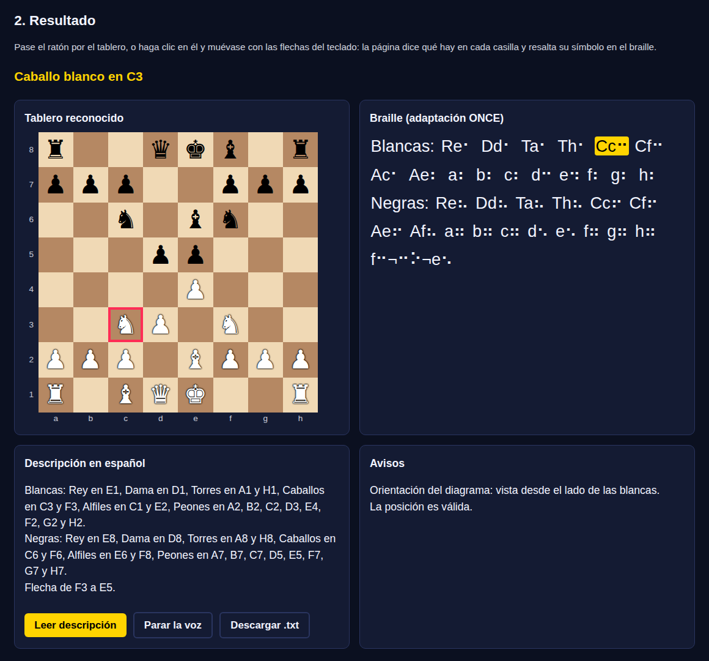
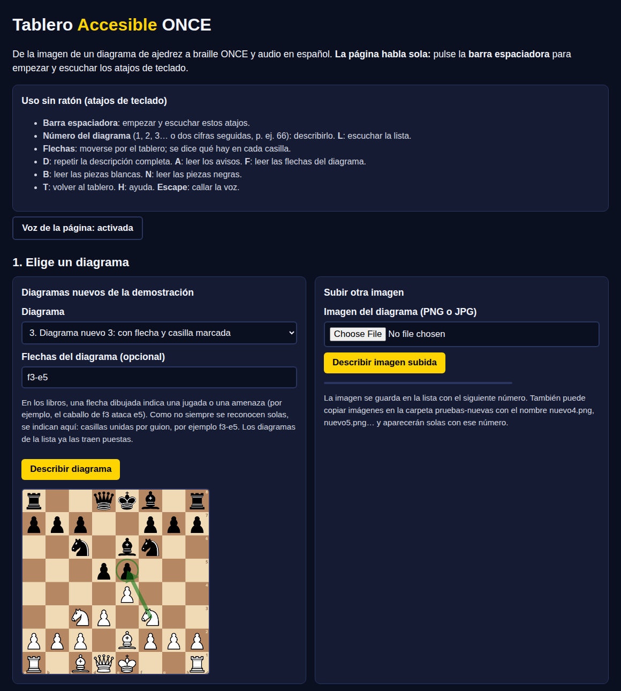

# ♟️ Tablero Accesible ONCE


-FF9900?logo=amazonaws&logoColor=white)


Convierte la **imagen de un diagrama de ajedrez** en una descripción que una **persona ciega** puede usar. Da dos salidas:

- **Braille** con la notación oficial de la ONCE.
- **Español hablado** o para lector de pantalla.

Incluye una **página web que se maneja solo con el teclado y habla sola**.

> 🥈 Proyecto que quedó en **2.º puesto** en el *Hackathon Kiro · Reto ONCE*, organizado por la **Universidad Camilo José Cela** con **Amazon Web Services (AWS)** y en colaboración con la **ONCE**.



---

## 🚀 Probarlo en 3 pasos (Windows, macOS o Linux)

1. Instala **Python 3.10 o superior** desde [python.org](https://www.python.org/downloads/). En Windows también vale `winget install -e --id Python.Python.3.12`.
2. Descarga el proyecto (botón verde **Code → Download ZIP**, y descomprímelo) o clónalo:
   ```bash
   git clone https://github.com/alexcancelalopez-source/tablero-accesible-once.git
   cd tablero-accesible-once
   python -m pip install -r requirements.txt
   ```
3. Arranca la página web:
   ```bash
   python app.py
   ```
   Se abre sola en **http://localhost:8000**. Pulsa la **barra espaciadora** y la página empezará a hablar.

Todo funciona **en tu ordenador y sin internet**: las imágenes no se envían a ningún servicio externo.

---

## ⌨️ Uso sin ratón (pensado para una persona ciega)

| Tecla | Qué hace |
|---|---|
| **Barra espaciadora** | La página empieza a hablar y lee todos los atajos (otra pulsación los repite). |
| **1, 2, 3…** | Describe el diagrama con ese número. Para dos cifras (12, 66…) se pulsan seguidas. |
| **Flechas** | Recorren el tablero casilla a casilla: «Caballo blanco en F3», «E4, vacía»… También resaltan ese símbolo en el braille. |
| **D** | Repite la descripción completa. |
| **B** / **N** | Lee las piezas blancas / negras. |
| **A** | Lee los avisos (orientación, validez, casillas dudosas). |
| **F** | Lee las flechas del diagrama. |
| **T** | Vuelve al tablero. |
| **L** | Lee la lista de diagramas. |
| **H** | Ayuda. |
| **Escape** | Calla la voz. |

Al terminar la descripción, el foco queda en la casilla **A1** para empezar a explorar. También funciona con NVDA, Narrador, JAWS y VoiceOver, porque el tablero es una cuadrícula ARIA con regiones *live*.

**Añadir diagramas nuevos:** súbelos desde la propia página y se guardan solos con el siguiente número. También puedes copiarlos en `pruebas-nuevas/` con los nombres `nuevo4.png`, `nuevo5.png`…

<details>
<summary>📸 Ver la pantalla de inicio</summary>



</details>

---

## 💻 Línea de comandos

```bash
python main.py pruebas-nuevas/nuevo3.png --flecha f3-e5
python main.py imagen.png --guardar salida.txt     # para una línea braille o un lector
```

Salida real con `pruebas-nuevas/nuevo3.png`:

```
BRAILLE (notación ONCE):
Blancas: Re⠂ Dd⠂ Ta⠂ Th⠂ Cc⠒ Cf⠒ Ac⠂ Ae⠆ a⠆ b⠆ c⠆ d⠒ e⠲ f⠆ g⠆ h⠆
Negras: Re⠦ Dd⠦ Ta⠦ Th⠦ Cc⠖ Cf⠖ Ae⠖ Af⠦ a⠶ b⠶ c⠶ d⠢ e⠢ f⠶ g⠶ h⠶
f⠒¬⠒⠕¬e⠢

AUDIO / LECTOR DE PANTALLA:
Blancas: Rey en E1, Dama en D1, Torres en A1 y H1, Caballos en C3 y F3, Alfiles en C1 y E2, ...
Negras: Rey en E8, Dama en D8, Torres en A8 y H8, Caballos en C6 y F6, Alfiles en E6 y F8, ...
Flecha de F3 a E5.
```

---

## 🎯 Por qué existe

La ONCE adapta a braille libros de ajedrez llenos de diagramas, y hoy cada diagrama se transcribe a mano. Un error en una casilla es invisible para el lector ciego, que no puede comparar con la imagen.

El objetivo es doble:
- que el transcriptor pase de **escribir** cada diagrama a **revisar** uno ya generado;
- que la persona ciega reciba la posición en el formato que ya conoce: braille ONCE o audio claro.

## ✨ Qué la hace diferente

1. **Entiende el tablero**: lo trata como 64 casillas con coordenadas, no como una foto que describir.
2. **Notación ONCE exacta**:
   - filas en braille de posición baja (1⠂ 2⠆ 3⠒ 4⠲ 5⠢ 6⠖ 7⠶ 8⠦);
   - orden fijo de piezas (R, D, T, C, A, peones);
   - casillas resaltadas entre `)` y `(`;
   - flechas con el formato `origen¬⠒⠕¬destino`.
3. **Corrige tableros girados**, vistos desde el lado de las negras.
4. **Nunca inventa**:
   - comprueba la posición: un rey por bando, como máximo 8 peones, ningún peón en las filas 1 u 8 y una pieza por casilla;
   - las casillas dudosas no las rellena, las marca como avisos.
5. **Encuentra errores en el propio material de referencia** comparando texto e imagen: en tres de los diagramas del documento había piezas omitidas o mal colocadas.
6. **Local y gratuito**: usa OpenCV, sin servicios externos ni claves.

## 🧠 Cómo funciona

```
imagen → estilo (digital / libro) → localización del tablero → silueta de cada pieza
       → tipo (comparación con un banco de siluetas) y color → orientación
       → casillas resaltadas y flechas → validación → braille ONCE + audio + avisos
```

## 📊 Precisión

`evaluar.py` cuenta las casillas acertadas sobre 64:

| Grupo | Resultado |
|---|---|
| Imágenes usadas para crear el banco de siluetas | 99,06 % |
| **Imágenes no vistas** | **97,19 %** (tableros digitales 100 %; diagramas de libro escaneados 95,31 % y 90,62 %) |

## 🛠️ Cómo se construyó con Kiro (AWS)

- **Steering** (`.kiro/steering/reglas-once.md`): 15 reglas numeradas con la notación ONCE y la forma de trabajar.
- **Spec** (`.kiro/specs/tablero-accesible-once/`):
  - `requirements.md`: 11 requisitos en formato EARS;
  - `design.md`: arquitectura, modelo de datos y 8 propiedades de corrección;
  - `tasks.md`: 20 tareas trazadas a los requisitos.
- **Tests** automáticos, incluidos tests basados en propiedades con Hypothesis: `python -m pytest`.
- El diagnóstico del reconocimiento de imagen está documentado en `docs/diagnostico_vision.md`.

## 📁 Estructura

```
app.py                  página web accesible (servidor local, sin dependencias extra)
main.py                 línea de comandos y flujo completo
evaluar.py              medición de precisión (necesita el material de la ONCE, ver abajo)
modulos/reconocimiento  visión por computador (siluetas.py), resaltados y flechas
modulos/orientacion     detección y corrección de tablero girado
modulos/validacion      legalidad de la posición
modulos/salidas         braille ONCE y audio
plantillas/             banco de siluetas de piezas
pruebas-nuevas/         diagramas de demostración (añade aquí los tuyos)
tests/                  tests unitarios y de propiedades
.kiro/                  steering y spec del proyecto en Kiro
```

## ℹ️ Material de la ONCE

Los tableros de ejemplo y el documento de reglas que la ONCE proporcionó para el hackathon **no se incluyen en este repositorio**, porque son material de la ONCE. La aplicación funciona igualmente:
- con los diagramas de `pruebas-nuevas/`;
- con cualquier imagen que subas desde la página web.

Solo `evaluar.py` y `docs/prototipo_vision.py` necesitan la carpeta `ejemplos/` original para calcular la precisión.

## 👤 Autor

**Alejandro Cancela López**, estudiante de Ingeniería Robótica e Inteligencia Artificial en la Universidad Camilo José Cela y Técnico Superior en Automatización y Robótica Industrial.

Gracias a **AWS**, a la **ONCE** y a la **UCJC** por el reto y la formación.

Licencia [MIT](LICENSE).
